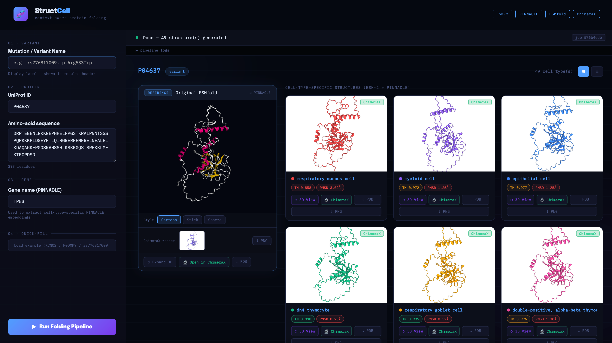
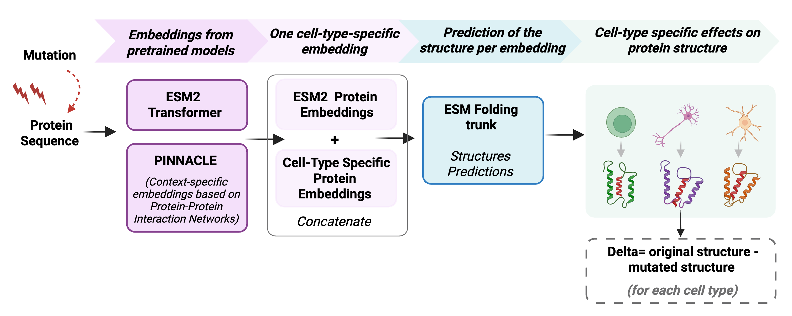

# StructCell: Injection of cell-type context into protein structures

This README explains how to build the interactive platform for predicting and visualizing protein structures across multiple cell types.

*By Athena Schumacher, Alma Dubuc. With the contribution of Dana Dayan.*
<br>
*Yale University*


*Visualization of StructCell Platform for cell-type-specific predictions.*

<br>
<br>


*Graphical abstract created with BioRender.* 

## Requirements

- 1 GPU (CUDA 11.8 or 12.4)
- [ChimeraX 1.10](https://www.cgl.ucsf.edu/chimerax/) *(optional — for PNG thumbnails; 3Dmol viewer works without it)*
- 40GB RAM, 4 CPUs

## Setup

### 1. Conda environment - ESM2, ESMFolf, Flask

This environment contains ESM2, ESMFold, flask and all their dependencies.

```bash
conda env create -f environment.yml
conda activate structcell_env
```

### 2. PINNACLE contextual embeddings

In addition to this environment, gitclone PINNACLE to obtain contextual embeddings.

```bash
git clone https://github.com/mims-harvard/PINNACLE
cd PINNACLE
# follow their README to download pinnacle_protein_embed.pth and pinnacle_protein_labels_dict.txt
```

Then update the paths in `app.py`:
```python
PINNACLE_EMBED_PATH  = "/path/to/pinnacle_protein_embed.pth"
PINNACLE_LABELS_PATH = "/path/to/pinnacle_protein_labels_dict.txt"
```


### 3. ChimeraX *(HPC only, optional)*

On the cluster:
```bash
module load ChimeraX
which chimerax
```
Then hard-code the path in `app.py`:
```python
CHIMERAX_BIN = "/path/to/chimerax"
```
Without ChimeraX, PNG thumbnails are disabled but the 3Dmol viewer works normally.


## Interactive Website

The interactive platform has been built using flask. The 2 scripts to start the platform are available in`flask_scripts/`. 

In order to launch the platform:

```bash
conda activate structcell_env
python flask_scripts/app.py
```

Then open `http://localhost:5000` in your browser.


## Cell-Type Specific Predictions

`flask_scripts/app.py` extracts ESM2 sequence embeddings, aggregates them with cell type-specific PINNACLE embeddings, and reinjects the combined representation into the ESMFold decoder to generate cell type-aware protein structures. Each prediction is then compared to a baseline structure (ESMFold without PINNACLE context) using US-align, which reports TM-score and RMSD.

It is also possible to test the effects of coding variants by mutating the input sequence. This platform therefore serves two purposes: predicting the structures of wild-type proteins across cell types, and detecting whether some coding variants have stronger structural effects in certain cell types than in others.

## Examples of cell-type specific predictions
`simulations_examples/` contains 2 examples of cell-type specific predictions for 2 different proteins, p53 and Calm1.

## Acknowledgements

StructCell leverages two published models, PINNACLE and ESM2.

Li, M.M., Huang, Y., Sumathipala, M., Liang, M.Q., Valdeolivas, A., Ananthakrishnan, A.N., Liao, K., Marbach, D., and Zitnik, M. (2024). Contextual AI models for single-cell protein biology. Nat Methods 21, 1546–1557. https://doi.org/10.1038/s41592-024-02341-3. 

Lin, Z., Akin, H., Rao, R., Hie, B., Zhu, Z., Lu, W., Smetanin, N., Verkuil, R., Kabeli, O., Shmueli, Y., et al. Evolutionary-scale prediction of atomic-level protein structure with a language model. 